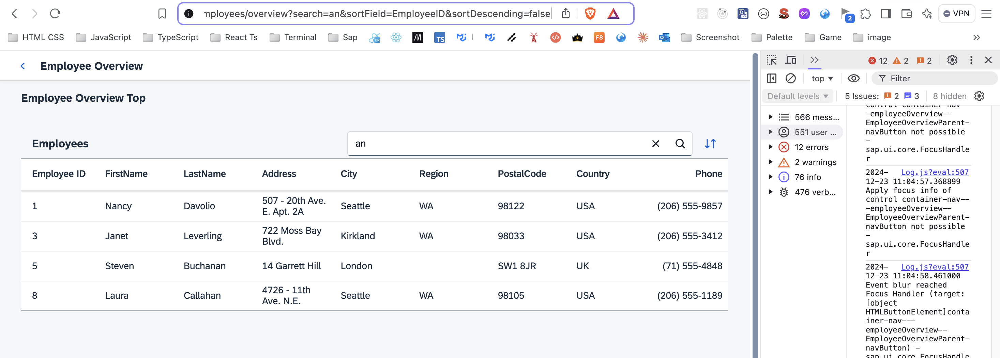

# Make Table Sorting Bookmarkable

Trạng thái sắp xếp hiện tại của table hiển thị trên URL

Cải tiến hơn nữa EmployeesOverviewContent controller để hỗ trợ việc tuỳ chọn sắp xếp trên URL.Mong đợi thêm 2 query parameters `SortField` và `SortDescending` từ URL cấu hình lên bảng. Trong quá trình handler matched của router employeeOverview,lưu trữ oQueryParameter và thêm lệnh gọi bổ sung vào `this._applySorter(oQueryParameter.sortField, oQueryParameter.sortDescending)` . Điều này kích hoạt hành động sắp xếp dựa trên hai tham số truy vấn `SortField` và `SortDescending` từ URL.

Tiếp theo `ViewSettingsDialog`.handler updates với các parameter tương ứng.Sau đó , chúng tôi gọi oRouter.navTo('employeeOverview',this.\_oRouterArgs, true) với các router arguments được update. Sau đó, cả previous arguments đó (tức là tìm kiếm) và new arguments cho việc sắp xếp sẽ được xử lý bởi trình xử lý sự kiện phù hợp cho employeeOverview route

Congratulations! Even the sorting options of the table can now be bookmarked. Try to access the following pages:

`webapp/index.html#/employees/overview?sortField=EmployeeID&sortDescending=true`

`webapp/index.html#/employees/overview?search=an&sortField=EmployeeID&sortDescending=true`
